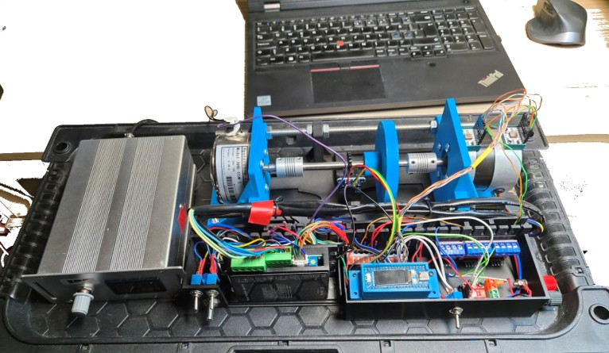

# Open BLDC Motor Test-Bench Dataset for Vibration and Current Analysis

## Introduction

### Motivation and Scope

This dataset is intended to support research and engineering work on practical
condition monitoring of BLDC motor systems. BLDC motors are widely used in
automation, robotics, ventilation, pumps, electric mobility, and other compact
electromechanical systems, but openly available BLDC datasets with synchronized
vibration, current, speed-related pulse information, and documented operating
conditions remain limited. This repository is created to reduce that gap by
providing raw measurements collected from a transparent and reproducible
test-bench arrangement.

A central idea of this dataset is that the measurement chain is based on a
low-cost and low-power acquisition device rather than on laboratory-grade
industrial instrumentation only. The use of a Raspberry Pi Pico 2, ADXL355
accelerometers, and INA226 electrical sensing reflects the type of hardware that
can plausibly be embedded near real machines, deployed in multiple locations,
or used in cost-sensitive industrial monitoring systems. This is important
because many condition-monitoring methods work well under ideal laboratory
conditions but become difficult to transfer when the sensing platform is too
expensive, power-hungry, or impractical for distributed use.

The recordings are therefore aimed at realistic algorithm development: signal
processing, feature extraction, anomaly detection, fault classification, sensor
fusion, robustness testing, and evaluation of models under non-ideal acquisition
conditions. The presence of sampling-time jitter, different motor loads,
different speed regimes, alternative power sources, a baseline noise recording,
and environmentally contaminated `ENV` recordings makes the dataset useful for
studying not only clean fault signatures, but also the measurement artifacts and
disturbances that appear in practical deployments.

The dataset is also designed to be readable and reusable. The CSV files contain
raw time-series channels with explicit timestamp information, the file names
encode the main experimental conditions, and the measurement setup is described
directly in this README. This makes the data suitable for exploratory analysis,
benchmarking, teaching, and as a starting point for building reproducible BLDC
motor diagnostics workflows.

### Measurement Setup

This repository contains time-series measurements collected from a BLDC motor
test bench for vibration and current analysis. The motor under test (MUT) is a
STEPPEROLINE BLDC Motor 57BYA54-24-01 driven by a BD10LR BLDC motor driver.
Mechanical load is applied using an AHB-05M hysteresis brake. Vibration is
measured with two ADXL355 accelerometers mounted on the front and rear bearing
mount rings, and electrical measurements are recorded with an INA226 current
sensor placed before the BLDC motor driver.

The measurements were collected using a Raspberry Pi Pico 2 at a nominal
sampling rate of 1 kHz. Small sampling-time jitter is present in the recordings,
so timing-sensitive analysis should use the recorded timestamp columns rather
than assuming a perfectly uniform sampling interval.



### Hardware Components

The main hardware components are:

| Component | Model / description |
| --- | --- |
| Motor driver | [BD10LR BLDC](<BLD-120A updated(BD10LR).pdf>) |
| Motor under test (MUT) | [STEPPEROLINE BLDC Motor 57BYA54-24-01](<57BYA54-24-01.pdf>) |
| Load | Hysteresis Brake AHB-05M |
| Vibration sensors | [ADXL355](<adxl354_adxl355.pdf>), mounted on the front and rear bearing mount rings |
| Current sensors | INA226 |
| Battery supply | NP-12-1.2Ah lead-acid battery, 2x in series |
| Laboratory power supply | UNIT-T UTP3305 |

### MUT Parameters

The motor under test is a BLDC Motor 57BYA54-24-01 with the following nominal
parameters:

| Parameter | Value |
| --- | --- |
| Phase | 3 |
| Poles | 4 |
| Rated voltage | 24 V |
| Rated torque | 0.16 Nm (22.66 oz.in) |
| Rated power | 50 W |
| Rated speed | 3000 +/- 10% rpm |
| Rated current | 2.90 A |
| No-load speed | 3800 +/- 10% rpm |
| Resistance per phase | 1.02 +/- 10% Ohms |
| Inductance per phase | 2.61 +/- 20% mH |

### Data Files

CSV files are stored in the `data/` directory.

Most file names follow this structure:

```text
analize_<state><id>[_ENV]_<speed>rpm_<load-current>mA_<power-source>.csv
```

Example:

```text
analize_healthy16_ENV_1000rpm_64mA_bat.csv
```

The `<state>` field identifies the MUT health state. The number immediately
following the state label, for example `10`, `15`, or `16` in `healthy10`, does
not encode an experimental condition; it is only an internal recording
identifier. The dataset covers four MUT health states:

| State | Status | Description |
| --- | --- | --- |
| Healthy | Done | Reference operating condition without the faults. |
| Front bearing fault | WIP | Fault condition associated with the front bearing. |
| Rear bearing fault | WIP | Fault condition associated with the rear bearing. |
| Shaft misalignment | WIP | Fault condition associated with shaft misalignment. |

The `<speed>rpm` field indicates the approximate MUT speed setpoint. The
operating-speed regimes represented in the dataset are 500, 1000, 1500, 2000,
and 2500 rpm. The exact rotational speed can be calculated from the `pg_rpm`
pulse signal, where six pulses correspond to one full mechanical revolution.

The `<load-current>mA` field indicates the current setting used to define the
approximate mechanical load. The mapping is given below.
The current value in each file name corresponds to the approximate motor load:

| Motor load | Current |
| --- | --- |
| ~15% | 19 mA |
| ~30% | 38 mA |
| ~50% | 64 mA |
| ~75% | 96 mA |
| ~100% | 128 mA |

The `<power-source>` suffix identifies the motor power source:

| Suffix | Motor power source |
| --- | --- |
| `bat` | Two NP-12-1.2Ah lead-acid batteries connected in series. |
| `mait` | UNIT-T UTP3305 laboratory power supply. |

File names containing `ENV` indicate recordings contaminated by environmental
disturbances. These disturbances may include footsteps, wind, nearby transport,
and structural vibrations transmitted through the surroundings.

The dataset also includes a baseline recording, `data/analize_0rpm_0mA.csv`,
captured with the test bench switched off. This file represents the background
sensor noise of the measurement chain without motor rotation or load current.

## CSV Columns

Each CSV file uses the following columns:

| Column | Description |
| --- | --- |
| `t_us` | Sample timestamp in microseconds. |
| `ax`, `ay`, `az` | ADXL355 vibration sensor axes measured on the front bearing ring, bearing type 608ZZ 8x22x7. |
| `ax1`, `ay1`, `az1` | ADXL355 vibration sensor axes measured on the rear bearing ring, bearing type 606ZZ 6x17x6. |
| `shunt_raw` | Raw INA226 shunt-voltage reading from the current sensor placed before the BLDC motor driver. |
| `bus_raw` | Raw INA226 bus-voltage reading from the current sensor placed before the BLDC motor driver. |
| `curr_raw` | Raw INA226 current reading from the current sensor placed before the BLDC motor driver. |
| `pg_rpm` | Pulse signal from the motor driver. Six pulses correspond to one full mechanical revolution. |
| `seq` | Sample sequence counter. |
| `dt` | Time difference between samples; use this together with `t_us` to account for the small sampling-time jitter. |

## License

The data and documentation in this repository are licensed under the Creative
Commons Attribution 4.0 International License (CC BY 4.0).
Full license text: https://creativecommons.org/licenses/by/4.0/legalcode.

You may use, copy, distribute, and adapt the data only if you give appropriate
credit to the author.

Recommended citation:

> Robertas Ūselis. Open BLDC Motor Test-Bench Dataset for Vibration and Current Analysis. 2026. https://github.com/Atikas/OpenData.
> License: CC BY 4.0.

If you modify the data, indicate that changes were made.
