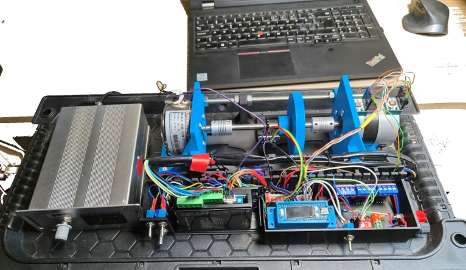
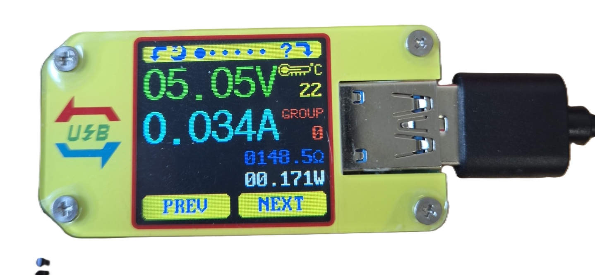
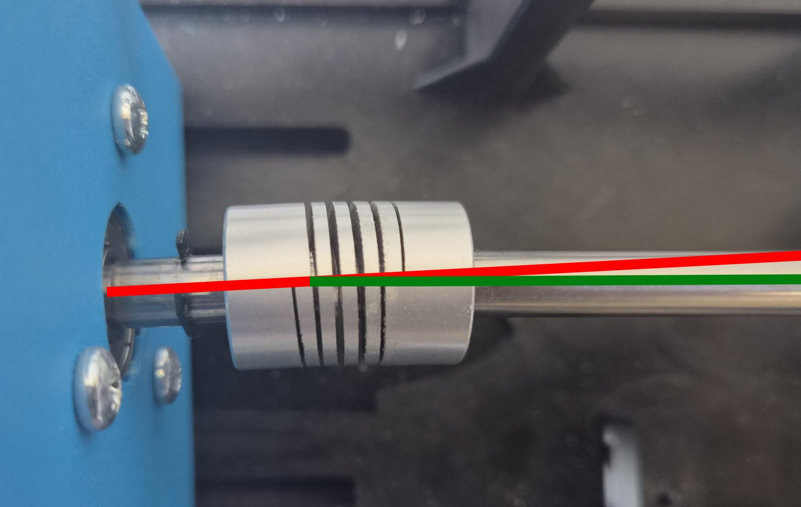

# Open BLDC Motor Test-Bench Dataset for Vibration and Current Analysis

## Introduction

### Motivation and Scope

This dataset is intended to support research and engineering work on practical
condition monitoring of BLDC motor systems. BLDC motors are widely used in
automation, robotics, ventilation, pumps, electric mobility, and other compact
electromechanical systems, but openly available BLDC datasets with synchronized
vibration, current, speed-related pulse information, and documented operating
conditions remain limited. This repository is created to reduce that gap by
providing raw measurements collected from a transparent and reproducible
test-bench arrangement.

A central idea of this dataset is that the measurement chain is based on a
low-cost and low-power acquisition device rather than on laboratory-grade
industrial instrumentation only. The use of a Raspberry Pi Pico 2, ADXL355
accelerometers, and INA226 electrical sensing reflects the type of hardware that
can plausibly be embedded near real machines, deployed in multiple locations,
or used in cost-sensitive industrial monitoring systems. This is important
because many condition-monitoring methods work well under ideal laboratory
conditions but become difficult to transfer when the sensing platform is too
expensive, power-hungry, or impractical for distributed use.

The recordings are therefore aimed at realistic algorithm development: signal
processing, feature extraction, anomaly detection, fault classification, sensor
fusion, robustness testing, and evaluation of models under non-ideal acquisition
conditions. The presence of sampling-time jitter, different motor loads,
different speed regimes, alternative power sources, a baseline noise recording,
and environmentally contaminated `ENV` recordings makes the dataset useful for
studying not only clean fault signatures, but also the measurement artifacts and
disturbances that appear in practical deployments.

Potential uses of the dataset include:

- Multimodal fault diagnosis using vibration, current, and rotational-speed data.
- Anomaly detection and self-supervised representation learning with limited labels.
- Domain adaptation across motor units, speeds, loads, power sources, and environmental conditions.
- Calibration and validation of physics-based models and digital twins.
- Signal reconstruction, denoising, missing-sample recovery, and sampling-jitter compensation.
- Virtual sensing of speed, load, or machine condition from a reduced set of measured channels.
- Development of edge condition-monitoring methods for resource-constrained acquisition hardware.
- Reproducible laboratory exercises in signal processing, machine diagnostics, and condition monitoring.

### Measurement Setup

This repository contains time-series measurements collected from a BLDC motor
test bench for vibration and current analysis. The motor under test (MUT) is a
STEPPEROLINE BLDC Motor 57BYA54-24-01 driven by a BD10LR BLDC motor driver.
Mechanical load is applied using an AHB-05M hysteresis brake. Vibration is
measured with two ADXL355 accelerometers mounted on the front and rear bearing
mount rings, and electrical measurements are recorded with an INA226 current
sensor placed before the BLDC motor driver.

The measurements were collected using a Raspberry Pi Pico 2 at a nominal
sampling rate of 1 kHz. Small sampling-time jitter is present in the recordings,
so timing-sensitive analysis should use the recorded timestamp columns rather
than assuming a perfectly uniform sampling interval.



### RP2350 Acquisition-Device Current Measurement

The RP2350 acquisition device was powered from a laptop USB port, and its
current was measured with a UM34C USB power meter. The measured current was
approximately 0.034 A during this test. This value should be treated as
indicative rather than fully representative because the microcontroller LCD was
enabled during the measurement. Measurements with the LCD disabled and firmware
optimized for current measurement are WIP.



### 3D-Printed Construction Parts

The `3d_prints/` directory contains the STL files used to 3D print the test-bench
mounts and other mechanical parts. The files can be used to reproduce or modify
the mechanical setup shown in the test-bench image above and should be used with
the hardware components listed below. The parts in the current test bench were
printed from PLA.

### Hardware Components

The main hardware components are:

| Component | Model / description |
| --- | --- |
| Motor driver | [BD10LR BLDC](<BLD-120A updated(BD10LR).pdf>) |
| Motor under test (MUT) | [STEPPEROLINE BLDC Motor 57BYA54-24-01](<57BYA54-24-01.pdf>) |
| Load | Hysteresis Brake AHB-05M |
| Vibration sensors | [ADXL355](<adxl354_adxl355.pdf>), mounted on the front and rear bearing mount rings |
| Current sensors | INA226 |
| Battery supply | NP-12-1.2Ah lead-acid battery, 2x in series |
| Laboratory power supply | UNIT-T UTP3305 |

### MUT Parameters

The motor under test is a BLDC Motor 57BYA54-24-01 with the following nominal
parameters:

| Parameter | Value |
| --- | --- |
| Phase | 3 |
| Poles | 4 |
| Rated voltage | 24 V |
| Rated torque | 0.16 Nm (22.66 oz.in) |
| Rated power | 50 W |
| Rated speed | 3000 +/- 10% rpm |
| Rated current | 2.90 A |
| No-load speed | 3800 +/- 10% rpm |
| Resistance per phase | 1.02 +/- 10% Ohms |
| Inductance per phase | 2.61 +/- 20% mH |


#### Front bearing fault

608ZZ ball

#### Rear bearing fault

606ZZ ball

#### Shaft misalignment

The shaft misalignment fault was introduced by setting a 2.5° angular
offset between the motor shaft and the coupled load shaft. 




### Data Files

CSV files are stored in the `data/` directory.

Most file names follow this structure:

```text
analize_<state><id>[_quality]_<speed>rpm_<load-current>mA_<power-source>.csv
```

Example:

```text
analize_healthy16_ENV_1000rpm_64mA_bat.csv
```

The `<state>` field identifies the MUT health state. The dataset covers 
MUT health states:

| State | Status | Data descriptors | Description |
| --- | --- | --- | --- |
| healthy | 100% | 69 CSV files | Reference operating condition without the faults. |
| front_ball | 100% | 63 CSV files | Fault condition associated with the front bearing. |
| rear_ball | 100% | 63 CSV files | Fault condition associated with the rear bearing. |
| misalignment | 100% | 63 CSV files | Fault condition associated with shaft misalignment. |
| demag | WIP | - | Fault condition associated with weakened motor magnets. |

The number `<id>` immediately following the `<state>` label encodes both the 
motor unit and the experiment number.
The first digit(s) indicate the motor unit, and the last digit indicates the
experiment number with same conditions. For example, `10` means motor 2, 
experiment 1; `25` means motor 3, experiment 6. The fault conditions were kept 
identical across motor units `1`, `2`, and `3`.
The same faulty 608ZZ front bearing, the same faulty 606ZZ rear bearing, and the
same 2.5° angular misalignment setup were used for each motor.
Motor index `0` is reserved exclusively for demagnetisation experiments and is 
not used for any other state.

The `<speed>rpm` field indicates the approximate MUT speed setpoint. The
main dataset covers operating speeds of 500, 1000, and 1500 rpm. Additional
recordings at 2000, 2500, and 3000 rpm are provided as supplementary data and
are limited to 75% or 100% motor load. The exact rotational speed can be
calculated from the `pg_rpm` pulse signal, where six pulses correspond to one
full mechanical revolution. A Python example of this calculation is provided in
[`examples/RPM_calculation.ipynb`](examples/RPM_calculation.ipynb).

The `<load-current>mA` field indicates the current setting used to define the
approximate mechanical load. The mapping is given below.
The current value in each file name corresponds to the approximate motor load:

| Motor load | Current |
| --- | --- |
| ~15% | 19 mA |
| ~30% | 38 mA |
| ~50% | 64 mA |
| ~75% | 96 mA |
| ~100% | 128 mA |

The `<power-source>` suffix identifies the motor power source:

| Suffix | Motor power source |
| --- | --- |
| `bat` | Two NP-12-1.2Ah lead-acid batteries connected in series. |
| `mait` | UNIT-T UTP3305 laboratory power supply. |

## Optional Quality Parameter

The `[_quality]` part of the file-name structure is an optional parameter that
describes signal quality. 

| `<quality>` value | Meaning | Description |
| --- | --- | --- |
| `ENV` | Environmental contamination | The recording contains environmental disturbances, such as footsteps, wind, nearby transport, or structural vibrations transmitted through the surroundings. |
| `SF` | Sensor failure or drift | The recording is affected by a sensor failure or sensor drift. |
| No label | Clean signal | No significant environmental contamination, sensor failure, or sensor drift was identified in the recording. |

## Baseline

The dataset also includes a baseline recording, `data/analize_0rpm_0mA.csv`,
captured with the test bench switched off. This file represents the background
sensor noise of the measurement chain without motor rotation or load current.

## CSV Columns

Each CSV file uses the following columns:

| Column | Description |
| --- | --- |
| `t_us` | Sample timestamp in microseconds. |
| `ax`, `ay`, `az` | ADXL355 vibration sensor axes measured on the front bearing ring, bearing type 608ZZ 8x22x7. |
| `ax1`, `ay1`, `az1` | ADXL355 vibration sensor axes measured on the rear bearing ring, bearing type 606ZZ 6x17x6. |
| `shunt_raw` | Raw INA226 shunt-voltage reading from the current sensor placed before the BLDC motor driver. |
| `bus_raw` | Raw INA226 bus-voltage reading from the current sensor placed before the BLDC motor driver. |
| `curr_raw` | Raw INA226 current reading from the current sensor placed before the BLDC motor driver. |
| `pg_rpm` | Square-wave pulse signal from the BLD10LR motor driver PG (pulse generator) output, used as a tachometer signal. Logic levels: 0/1. Six pulses correspond to one full mechanical revolution. |
| `seq` | Sample sequence counter. |
| `dt` | Time difference between samples; use this together with `t_us` to account for the small sampling-time jitter. |

## License

The data and documentation in this repository are licensed under the Creative
Commons Attribution 4.0 International License (CC BY 4.0).
Full license text: https://creativecommons.org/licenses/by/4.0/legalcode.

You may use, copy, distribute, and adapt the data only if you give appropriate
credit to the author.

Recommended citation:

> Robertas Ūselis. Open BLDC Motor Test-Bench Dataset for Vibration and Current Analysis. 2026. https://github.com/Atikas/OpenBLDCData.
> License: CC BY 4.0.

If you modify the data, indicate that changes were made.

## FAIR Principles

This dataset is designed to align with the [FAIR data principles](https://www.go-fair.org/fair-principles/) (Findable, Accessible, Interoperable, Reusable):

| Principle | How it is addressed |
| --- | --- |
| **Findable** | The dataset is publicly hosted on GitHub at https://github.com/Atikas/OpenBLDCData. File names encode experimental conditions, making individual recordings easy to identify without opening the files. |
| **Accessible** | All data files are openly available without authentication. The repository can be cloned or individual files downloaded directly via standard HTTPS. |
| **Interoperable** | Data is stored in plain CSV format with clearly named columns and explicit timestamp information. No proprietary software or format is required to read the files. |
| **Reusable** | Each file is accompanied by a documented measurement setup, hardware description, column definitions, and operating conditions in this README. The dataset is released under CC BY 4.0, which permits broad reuse with attribution. |

> **Note:** A persistent identifier (DOI) has not yet been assigned. For long-term citability and formal publication, archiving the dataset on a repository such as [Zenodo](https://zenodo.org) is recommended.

## Collaboration

If your research requires operating conditions or measurements that are not
currently included in the dataset, please open a GitHub issue describing the
data you need. I am open to collaboration and may be able to collect additional
measurements using this test bench.

<!-- ## Support

If you find this dataset useful, you can support my work through
[Buy Me a Coffee](https://buymeacoffee.com/atikas).

[](https://buymeacoffee.com/atikas) -->
